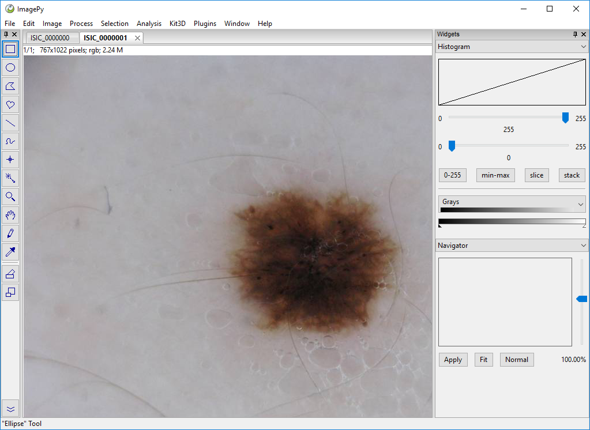
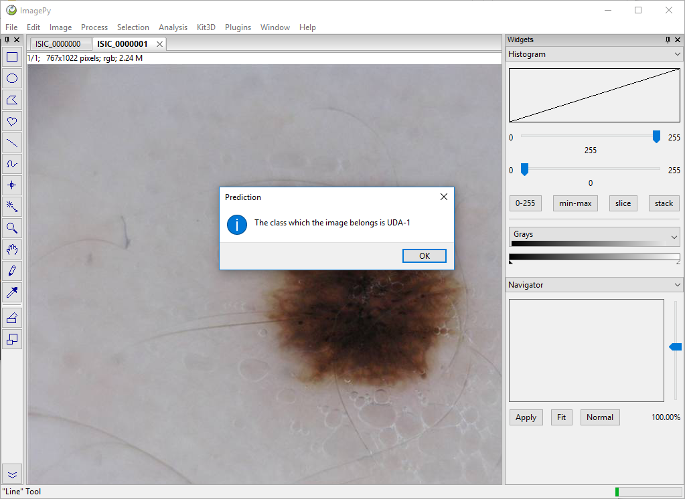

# DeepClas4BioImagePyISIC

DeepClas4BioImagePyISIC is an ImagePy plugin that connects ImagePy with the [DeepClas4Bio API](https://github.com/adines/DeepClas4Bio).  This plugin allows ImagePy users to use the ResNet model of Keras trained in the ISIC dataset to classify an image. 

## Requirements
To use this plugin is necessary to have installed ImagePy with python 3.6 and the [DeepClas4Bio API](https://github.com/adines/DeepClas4Bio).

## Installation
To install this plugin you have to download it and put it in the path imagepy --> menus --> Plugins --> DeepClas4Bio.

## About the model
This plugin use a Keras model, the ResNet34 model, trained in the ISIC dataset. The steps we have followed to fine-tune this model can be found in the following [Colab Notebook](https://colab.research.google.com/drive/1z3h_oNZnfLjxfdOmYIUtpUVxkib3axg1#scrollTo=sYp9yBIkN-CW).

## Using the plugin
In this section, we will see an example of how to use this plugin. For this example we will classify an ISIC image. 

To use the plugin you must follow the following steps:

 1. Load the image that you want to classify

 2. Run the plugin
 Go to Plugins and search the name of the plugin in this case DeepClas4BioPy.

 
 3. Visualize the output
 
